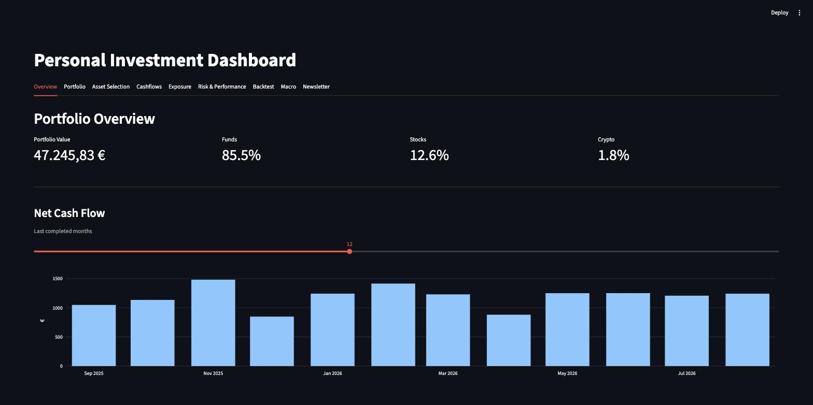
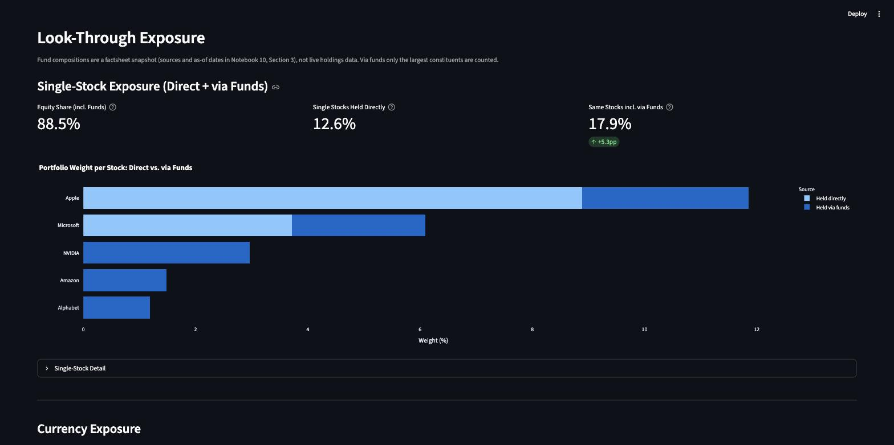
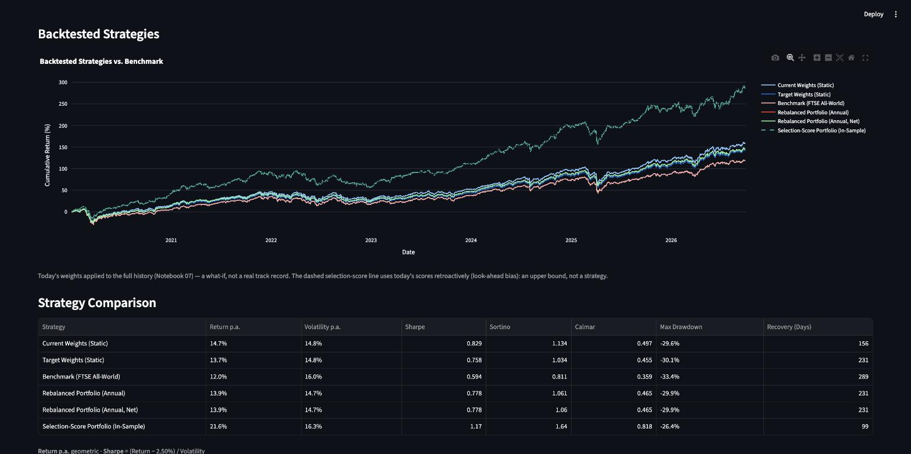

# Personal Investment Analytics Dashboard

A modular Python-based personal investment analytics system for a long-term,
passive buy-and-hold portfolio — not a trading tool, no buy/sell signals.

> **Disclaimer:** built for personal use and learning. Nothing in this
> repository (notebooks, dashboard or newsletter) is investment advice;
> all figures are what-if analyses on historical data and simplifying
> assumptions.

## Project Goal

This project processes brokerage transaction exports, reconstructs portfolio
holdings, calculates risk/performance/exposure metrics, evaluates watchlist
assets on quantitative and fundamental grounds, and visualizes all of it in
an interactive Streamlit dashboard. A one-way data flow keeps things simple:
notebooks compute and write CSVs to `data/processed/`, the dashboard only
reads and displays them — no calculations happen in the app layer.

## Features

- Transaction and cashflow analysis
- Portfolio holdings reconstruction from brokerage transactions
- Current vs. target portfolio weights, buy-only rebalancing suggestions
- Risk and performance analytics (Sharpe, Sortino, Calmar, drawdowns, XIRR)
- Asset universe and watchlist monitoring
- Quantitative asset selection scoring (performance percentile + strategic role)
- Cash/consumption analytics
- Historical backtesting of multiple portfolio strategies
- Mean-variance portfolio optimization (efficient frontier)
- Stress testing: hypothetical, historical (2022, COVID) and FX scenarios
- Factor, sector, country and currency exposure, incl. look-through for funds
- Macro/policy sentiment from Fed and ECB speeches, classified via a local LLM
- Fundamental scoring (valuation, quality, growth, balance-sheet strength) for
  individual stock holdings
- Interactive Streamlit dashboard
- Daily newsletter integration
- One-command automation pipeline for the full notebook run

## Tech Stack

Python 3.14, pandas, NumPy, SciPy, Matplotlib/Plotly, Streamlit, yfinance,
pytest, Jupyter + nbstripout (registered as a git clean filter, so notebook
outputs never end up in version control). Notebook 11 additionally uses
feedparser, BeautifulSoup4/lxml, pypdf, and [Ollama](https://ollama.com) as
an external local LLM runtime (HTTP API on `localhost:11434`, not a pip
package — install and run it separately).

## Setup

```bash
python3.14 -m venv .venv
source .venv/bin/activate
pip install -r requirements.txt
nbstripout --install   # registers the notebook-output-stripping git filter
```

For Notebook 11 (Macro/Policy Sentiment), also install and start
[Ollama](https://ollama.com) and pull a model (developed against
`qwen3:4b-instruct-2507-q4_K_M`).

## Try It with Sample Data

No brokerage export at hand? The repo ships a fictitious one
(`data_sample/raw/data.csv`: a monthly savings plan since 2020, a few stock
and crypto buys, salary, rent and everyday card payments at made-up
merchants; prices are real market data):

```bash
scripts/run_pipeline.sh --demo --launch-dashboard
```

This runs all notebooks on the sample data in `data_sample/` (seeding the
example configuration on the way) and opens the dashboard on it. Your own
`data/` is never touched; executed notebooks go to
`data_sample/executed_notebooks/`. The macro notebook (needs a local Ollama
model) and the newsletter are skipped. To regenerate the sample export:
`python scripts/make_sample_data.py`.

Under the hood, notebooks and dashboard read their data directory from the
`INVESTMENT_DATA_DIR` environment variable (default `data/`, see
`src/paths.py`), so the dashboard can also be pointed at the sample data
directly: `INVESTMENT_DATA_DIR=data_sample streamlit run app/dashboard.py`.

## Use It with Your Own Data

The pipeline reads the **transaction CSV export from the Trade Republic web
app** (app.traderepublic.com). Everything stays on your machine: the dashboard
only listens on `localhost`, and your export and settings are gitignored.

1. **Look at the demo first** (see above) to know what you'll get.
2. **Export your transactions** in the Trade Republic web app
   (app.traderepublic.com): *Profile → Statements → Transaction export →
   Download*. Save the CSV as `data/raw/data.csv`.
3. **Run the pipeline:** `scripts/run_pipeline.sh --skip-macro --skip-newsletter`
   (drop the flags if you use Ollama / the newsletter). On the first run
   Notebook 02 stops with a list of your holdings that don't have a Yahoo
   Finance ticker yet and writes them to `data/manual/ticker_map_template.csv`.
4. **Map your holdings to tickers:** in `ticker_map_template.csv`, fill in
   `yf_ticker` and `price_currency` for every row, then save it as
   `data/manual/ticker_map_manual.csv` (replacing the example there). Find the
   ticker via the search on [finance.yahoo.com](https://finance.yahoo.com):
   the exchange suffix matters, e.g. `.DE` for Xetra (EUR), `.AS` Amsterdam,
   no suffix for US stocks (USD), `BTC-EUR` for Bitcoin. `price_currency` is
   the currency Yahoo quotes the ticker in — avoid London tickers quoted in
   pence (`GBp`). A holding you leave unmapped (e.g. a delisted stock) is
   simply left out of the valuation.
5. **Run the pipeline again.** Now Notebook 02 stops because your holdings
   have no target weight yet, and `data/manual/target_weights_manual.csv`
   exists with an example allocation. Replace it with one row per holding:
   `symbol` = the ISIN from your export, `target_weight` as a fraction; all
   weights sum to 1.
6. **Run the pipeline a third time** — now it goes through; add
   `--launch-dashboard` to open the dashboard right after. The remaining
   settings files are created with generic examples along the way.
7. **Add your holdings to the universe (recommended):** replace the examples in
   `data/manual/asset_universe_manual.csv` with your holdings and watchlist —
   `role`/`role_score`, `stress_bucket`, and `sector` for single stocks (see
   the [Configuration Reference](#configuration-reference)). Until then, Asset
   Selection and Fundamentals show the example assets, and stress test and
   exposure guess each holding's bucket (with a warning).
8. **Refine when you like:** fund compositions (`bucket_lookthrough_manual.csv`)
   and merchant corrections for spending categories
   (`merchant_overrides_manual.csv`).

To refresh later, drop a new export into `data/raw/data.csv` and run the
pipeline again; your settings are never overwritten.

**Other brokers:** the notebooks expect the Trade Republic column layout.
Convert your broker's export to the same header as
`data_sample/raw/data.csv` (columns you don't have can stay empty). What
matters: `date`, `type` (e.g. `BUY`, `SELL`, `DIVIDEND`, `CARD_TRANSACTION`;
full list in `ECONOMIC_TYPE_MAP` in `src/portfolio.py`), `symbol` (ISIN),
`name`, `asset_class` (`FUND`, `STOCK`, `CRYPTO`), `shares`, `price`,
`amount` (negative = money out), `fee`, `currency` (EUR), and for spending
analysis `description` and `mcc_code`.

## Daily Newsletter (optional)

A local agent (`newsletter-agent/`, Google ADK + Gemini with Google Search)
writes a daily briefing on markets, macro and AI for your portfolio: a
price table of your holdings, portfolio-relevant news and an assessment
against your long-term allocation — no buy/sell recommendations. The
dashboard's Newsletter tab shows the saved issues; the demo includes an
example issue (`data_sample/newsletter/`).

1. Install [uv](https://docs.astral.sh/uv/) and [pandoc](https://pandoc.org/)
   (for the HTML version).
2. Create a free Gemini API key in [Google AI Studio](https://aistudio.google.com/)
   and put it into `newsletter-agent/.env` (copy `.env.example`):
   `GOOGLE_API_KEY=...`
3. **Describe yourself as the reader** in `data/manual/newsletter_profile_manual.md`
   (free text, gitignored). Without it the agent uses this example profile —
   copy it and adapt it:

   ```text
   I follow financial markets, macroeconomics and AI/ML and invest for the long
   term with a passive buy-and-hold approach. Technical background: statistics/data science.

   Career/learning topics: statistics, machine learning, data science jobs.
   ```

4. Optional: a short risk note per position in
   `data/manual/newsletter_asset_notes_manual.csv` (`yf_ticker,note`), which the
   agent takes into account when assessing news for that holding.
5. Run it: `scripts/run_newsletter.sh` — or let `scripts/run_pipeline.sh` trigger
   it after the notebooks. Issues are saved as Markdown and HTML in
   `newsletter-agent/Newsletter_output/` (override with `NEWSLETTER_OUTPUT_DIR`).

Portfolio and target weights come from the same settings files as the
dashboard. The newsletter is written in English; for another language add
e.g. `NEWSLETTER_LANGUAGE=German` to `newsletter-agent/.env`.

## Configuration Reference

Personal configuration lives in `data/manual/*.csv` — gitignored, since
it's specific to your own portfolio. On a fresh checkout these files don't
exist yet, so the notebooks seed each one with a small generic example on
first run and never overwrite it again afterwards. Edit the CSVs directly
(or delete one and re-run the notebook to get the example back) to plug in
your own holdings.

| File | Seeded by | What to fill in |
|---|---|---|
| `ticker_map_manual.csv` | Notebook 02 | ISIN from your broker export → Yahoo Finance ticker and currency |
| `target_weights_manual.csv` | Notebook 02 | Your target allocation per position (sums to 1) |
| `asset_universe_manual.csv` | Notebook 04 | Holdings + watchlist: `asset_class`, `region`, `role`, `role_score` (0–1, strategic importance), optional `history_proxy` (ticker on the same index with longer history), `stress_bucket` (see below), and for single stocks `sector` (GICS) and optional `country` |
| `merchant_overrides_manual.csv` | Notebook 06 | Regex pattern → merchant / spending category, for card payments the MCC gets wrong |
| `bucket_lookthrough_manual.csv` | Notebooks 09/10 | Composition of each fund type (see below) |
| `newsletter_profile_manual.md` | — (optional, create it) | Free-text reader profile for the newsletter (see above) |
| `newsletter_asset_notes_manual.csv` | — (optional, create it) | `yf_ticker,note`: risk note per position for the newsletter |

**Stress buckets and look-through.** Every holding gets one `stress_bucket`
— a coarse risk category: `global_equity`, `em_equity`, `europe_equity`,
`small_cap`, `tech_thematic`, `gold`, `crypto`, `us_single_stock`,
`eu_single_stock`. Set it in the `stress_bucket` column of
`asset_universe_manual.csv` for every position you hold (single stocks also
need `sector` there). Holdings without one fall back to a guess by asset
class and region, with a warning in Notebooks 09/10 naming the tickers —
a guess can badly misstate a scenario (e.g. a gold fund treated as global
equity). Stress scenarios (Notebook 09) shock buckets, not tickers.
`bucket_lookthrough_manual.csv` describes what a fund bucket contains, one
row per value:

```csv
bucket,dimension,category,weight,source,as_of,note
global_equity,country,USA,0.72,<factsheet URL>,2026-08-31,
global_equity,currency,USD,0.72,<factsheet URL>,2026-08-31,derived from country weights
global_equity,top_holding,AAPL,0.05,<factsheet URL>,2026-08-31,
```

To fill it: open the factsheet of the fund you hold in that bucket (the
provider's or justETF), add one row per country, sector and currency —
weights per bucket and dimension must sum to 1, lump small ones into
`Other ...` — and optionally the largest constituents as `top_holding`.
The currency rows also set the USD share used in the EUR/USD stress
scenario. Single-stock buckets need no rows. The notebooks validate the
file and stop with a clear message if sums or bucket names are off.

## Running It

```bash
streamlit run app/dashboard.py        # the dashboard
pytest                                 # the test suite
scripts/run_pipeline.sh                # re-run all 12 notebooks end to end
```

`run_pipeline.sh` executes the notebooks in dependency order, refreshing every
CSV in `data/processed/`, then triggers the newsletter. Flags:
`--demo` (sample data, see above), `--skip-macro`, `--skip-consumption`,
`--skip-newsletter`, `--launch-dashboard`.

## Notebook Pipeline

| # | Notebook | What it does |
|---|---|---|
| 01 | Transactions & Cashflows | Parses brokerage transaction exports into clean, categorized cashflow records |
| 02 | Portfolio Holdings Tracker | Reconstructs current holdings and weights from the transaction history |
| 03 | Portfolio Risk & Performance | Prices, returns, and risk/performance metrics for the current portfolio |
| 04 | Asset Universe & Watchlist | Builds the tracked universe (holdings + watchlist) with return/risk stats per asset |
| 05 | Asset Selection Scoring | Quantitative percentile scoring (Sharpe, drawdown, volatility — over one common window, short histories back-filled with a same-index proxy) blended with strategic role into Keep/Review/Candidate/Watch decisions |
| 06 | Cash & Consumption Analytics | Categorizes and summarizes non-investment spending |
| 07 | Portfolio Backtesting | Compares portfolio strategies (current, target, benchmark, rebalancing variants, selection-score-weighted, DCA) over history — see [Key Concepts](#key-concepts) below for the biases this has to guard against |
| 08 | Portfolio Optimization | Mean-variance efficient frontier and ex-ante Sharpe-optimal weights |
| 09 | Portfolio Stress Testing | Portfolio loss under hypothetical shocks (per risk bucket), historical replays (2022, COVID crash) from actual returns, an EUR/USD translation shock and a single-position loss |
| 10 | Factor & Sector Exposure | Country/sector/currency exposure and market beta, including look-through exposure via fund holdings |
| 11 | Macro/Policy Sentiment | Classifies Fed/ECB speech stance (hawkish/dovish) via a local LLM into a sentiment time series, shown against the actual policy rates as a reference |
| 12 | Fundamental Stock Scoring | Percentile-based valuation/quality/growth/balance-sheet scoring for individual stock holdings (funds and crypto excluded — no comparable fundamentals) |

Execution order is plain numeric order 01→12, which already satisfies every
dependency (e.g. 02 must precede everything that reads current holdings).

## Dashboard

Tabs: Overview, Portfolio, Asset Selection, Cashflows, Exposure,
Risk & Performance, Backtest, Macro, Newsletter.

Screenshots from the demo (fictitious sample data, see
[Try It with Sample Data](#try-it-with-sample-data)):







## Key Concepts

A few concepts that come up across the risk/backtesting notebooks and aren't
obvious from a column name alone:

- **Look-ahead bias**: at a point in time `t` in a backtest, only information
  that was actually known at `t` may be used. Applying *today's* portfolio
  weights across the full historical return series answers "how would my
  current allocation have performed since inception" — a deliberate
  what-if question, not a real track record. It becomes a problem when a
  strategy pretends to have had information earlier than it actually existed
  — e.g. applying today's `selection_score` (Notebook 05) retroactively to
  2021.
- **Buy-and-hold vs. periodic rebalancing**: buy-and-hold means buying once
  and letting weights drift freely afterward; rebalancing means trimming back
  to target weights at fixed intervals (e.g. quarterly).
- **Benchmark**: a simple passive reference (e.g. 100% MSCI World / FTSE
  All-World) to check whether the analysis effort adds any value over just
  holding the index.
- **Turnover**: the share of portfolio value traded at each rebalancing date
  — the real-world cost/tax tradeoff behind how often to rebalance.
- **Recovery time**: time from a maximum drawdown until the portfolio value
  reaches its old high again.
- **DCA (dollar-cost averaging) simulation**: regular periodic purchases over
  time instead of a lump-sum investment.

## Metrics Glossary

The metrics worth remembering — the ones that aren't self-explanatory from
their column name. Simple arithmetic (market value, weight, cash inflow,
cost basis, etc.) isn't listed here; the notebook that produces a given
number is always the source of truth. Weights and cutoffs below are the
defaults defined as constants in `src/`; the dashboard explains each score
with the values actually in use.

| Metric | Definition | Why it matters |
|---|---|---|
| Sharpe Ratio | (Annualized Return − Risk-Free Rate) / Annualized Volatility | Return per unit of total risk — the standard risk-adjusted comparison across strategies. |
| Sortino Ratio | (Annualized Return − Risk-Free Rate) / Downside Deviation | Like Sharpe, but only penalizes downside volatility — ignores upside swings that Sharpe punishes too. |
| Calmar Ratio | Annualized Return / \|Max Drawdown\| | Return relative to the worst historical loss, not just average volatility. |
| XIRR (Money-Weighted Return) | Internal rate of return solving NPV(rate) = 0 over dated cash flows | The correct way to annualize the DCA simulation — each contribution has a different holding period, so a raw `gain / invested` isn't comparable to the other strategies. |
| Turnover | 0.5 × sum(\|drifted weight − target weight\|) at each rebalance date | Drives transaction costs — the tradeoff behind how often to rebalance. |
| Risk Contribution (%) | weight_i × marginal risk contribution_i, normalized to sum to 1 | Shows which positions actually drive portfolio risk — can differ a lot from position weight. |
| Effective Number of Positions | 1 / HHI, where HHI = sum of squared weights | How concentrated the portfolio really is, expressed as "equivalent number of equal-sized positions." |
| Market Beta | Cov(portfolio, benchmark) / Var(benchmark), on weekly returns | How strongly the portfolio moves with the market (1.0 = one-for-one). Weekly, because the Xetra benchmark and US stocks/crypto close hours apart — daily returns would understate beta. |
| Look-Through Exposure | Each fund split into its countries/sectors/currencies/largest constituents (index factsheets), summed with directly held stocks | Shows the real exposure behind the fund names — e.g. how much USD or single-stock risk sits inside a "world" ETF. |
| Quant Score | 0.50 × Sharpe + 0.30 × Drawdown + 0.20 × Volatility (each a percentile score across the universe, computed over one common window) | Risk-adjusted performance rank. Raw return is not scored separately — Sharpe already contains it, so adding it again would double-count return. |
| History Proxy | Returns of a fund on the same index, used before an asset's own price history starts | Without it, a recently listed ETF would be compared over a shorter (e.g. crash-free) window and look artificially good; with it, all assets share one comparison window. Also extends the portfolio backtest (Notebooks 03/07) back to 2020 instead of starting at the youngest holding's listing date. |
| Selection Score | 0.60 × Quant Score + 0.40 × Role Score | Combines performance percentile with strategic role — the number behind the Keep / Review / Candidate decision. |
| Decision Bucket | Keep, Keep – strategic role, Review, Candidate, Watch | The actual actionable output of the Selection Score, not just a raw number. |
| Fundamental Score | 0.25 × Valuation + 0.30 × Quality + 0.25 × Growth + 0.20 × Health (each a percentile sub-score; growth = 3-year CAGR of revenue and net income from the fiscal-year statements) | Valuation/quality/growth/balance-sheet-strength blend for individual stock holdings, computed only within your own STOCK-class universe (holdings + watchlist) — funds and crypto have no comparable fundamentals and are excluded. Missing fields are skipped (weights re-normalised), too little data gives "Watch – limited data" instead of a score. |
| Fundamental Rating | Strong / Average / Weak fundamentals, or Watch – limited data | Bucket derived from the Fundamental Score; "limited data" fires when too few of the underlying yfinance fields are available. |
| MCC (Merchant Category Code) | ISO 18245 code the card network attaches to every card payment (e.g. 5411 = grocery store) | Primary signal for spending categories: set by the payment network, not guessed from the merchant name. Direct debits carry no MCC and fall back to keyword rules; generic codes (e.g. 5999 misc. retail) only act as a last fallback. |

Caveats worth keeping in mind:

- **Static-weights backtest (Notebook 07):** applies *today's* weights across
  the entire historical return series — a what-if scenario, not a real track
  record (see [Key Concepts](#key-concepts) above).
- **Stress tests (Notebook 09):** instantaneous shocks on today's holdings —
  no path over time, no rebalancing during the stress. Hypothetical shock sizes
  and the USD shares behind the FX scenario are judgement calls; read the
  results as orders of magnitude, not forecasts.
- **Look-through exposure (Notebook 10):** fund compositions are a factsheet
  snapshot kept in a local, gitignored file (source and as-of date per value;
  a fresh checkout runs on a generic example), refreshed by hand. Via funds
  only the largest constituents are counted, so indirect single-stock exposure
  is a lower bound.
- **Policy sentiment (Notebook 11):** a small local model classifying a
  handful of speeches per month — indicative, not a signal. History only
  goes back to the first run (the Fed RSS feed holds ~15 speeches), the ECB
  export is updated monthly, and ECB slide decks have no text and are
  skipped. The policy rate line is the reality check.
- **Fundamental Score (Notebook 12):** percentile-ranked against your own
  stock holdings and watchlist, not the market — "strong" means strong
  relative to the names you track. The fewer stocks, the coarser: with a
  handful, a single outlier can swing another stock's percentile by a full
  quartile. Read the ranking as directional, not as a precise cardinal score.

Shared implementations live in `src/` — `risk.py` (Sharpe, Sortino, Calmar,
risk contribution, HHI/effective N), `portfolio.py` (holdings, rebalancing),
`backtest.py` (rebalancing, DCA, XIRR), `optimization.py` (mean-variance /
risk-parity solvers), `stress.py` (stress scenarios), `exposure.py`
(look-through exposure, market beta), `selection.py` (Selection Score),
`fundamentals.py` (Fundamental Score), `consumption.py` (spending
categories), `macro_sentiment.py` (speech classification) and `paths.py`
(data directory) — unit-tested, single source of truth if a number looks
off.

## Privacy

Raw transaction exports and all processed/manual private data
(`data/raw/`, `data/processed/`, `data/manual/`, `data/private/`), the
newsletter's API key (`newsletter-agent/.env`) and its saved issues are
excluded from this repository. Only code, notebooks (with outputs stripped
via `nbstripout`), the fictitious sample data in `data_sample/` and
non-sensitive project structure are version-controlled. The dashboard only
listens on `localhost`, so it isn't reachable from other devices on your
network.

## How This Was Built

Developed with AI assistance: [Claude Code](https://claude.com/claude-code)
(Anthropic) served as a pair-programming assistant for writing and
refactoring code, reviewing notebooks and drafting documentation. Scope,
methodology and design decisions were made by the author, who went through
the pipeline notebook by notebook; the shared logic is covered by a `pytest`
suite, and results were cross-checked against real data (e.g. policy rates,
fund factsheets).

## License

[MIT](LICENSE)
